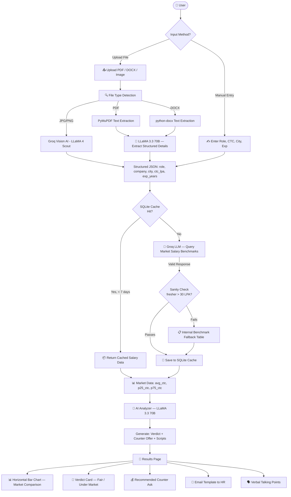

<div align="center">


# OfferSense 💼

### Know Your Worth. Negotiate Smarter.

**OfferSense** is a full-stack AI-powered web app that helps Indian freshers and early-career professionals instantly evaluate their job offer letters against real market salary data — and gives them the exact words to negotiate a better deal.

[](https://react.dev)
[](https://fastapi.tiangolo.com)
[](https://vitejs.dev)
[](https://tailwindcss.com)
[](https://groq.com)
[](https://python.org)
[](LICENSE)

[🚀 Live Demo](#demo) • [📖 Docs](#api-documentation) • [⚙️ Setup](#getting-started) • [🤝 Contributing](#contributing)

</div>

---

## 🎥 Demo

> **Upload your offer letter or enter details manually — get a full salary market analysis in under 15 seconds.**

https://github.com/Shivam8292/OfferSense/assets/demo/offersense-demo.mp4

> 📌 *Don't have a video yet? Clone the repo, run locally, and record your own!*

---

## ✨ Features

| Feature | Details |
|---|---|
| 📄 **Multi-format Upload** | PDF, Word (DOCX), JPG, PNG offer letters supported |
| 🤖 **AI Extraction** | LLaMA 3.3 70B reads and extracts role, CTC, city, experience automatically |
| 📊 **Market Comparison** | Real-time salary benchmarks via AI + internal benchmark table |
| 🎯 **Negotiation Verdict** | Fair / Slightly Under / Significantly Under Market classification |
| 💬 **Negotiation Scripts** | Full HR email template + verbal talking points generated by AI |
| ✍️ **Manual Entry** | Works without a document — just enter your details |
| ⚡ **Blazing Fast** | Groq inference runs in ~1-3 seconds |
| 🔒 **Privacy First** | No data stored, files processed in-memory only |

---

## 🔄 How It Works — System Flowchart



---

## 🏗️ Architecture

```
OfferSense/
├── 📁 backend/                    # FastAPI Python backend
│   ├── main.py                    # App entry point, CORS, rate limiting
│   ├── requirements.txt           # Python dependencies
│   ├── Procfile                   # Railway deployment config
│   ├── .env                       # GROQ_API_KEY (not committed)
│   ├── offersense.db              # SQLite salary cache
│   ├── 📁 routers/
│   │   └── analyze.py             # POST /analyze/pdf + /analyze/manual
│   └── 📁 services/
│       ├── pdf_extractor.py       # PDF / DOCX / Image text extraction
│       ├── salary_fetcher.py      # Market salary lookup (LLM + fallback)
│       └── ai_analyzer.py        # Verdict + counter offer + script gen
│
├── 📁 frontend/                   # React + Vite frontend
│   ├── index.html
│   ├── tailwind.config.js
│   ├── 📁 src/
│   │   ├── App.jsx                # Page state machine
│   │   ├── index.css              # Global styles + Tailwind
│   │   └── 📁 components/
│   │       ├── LandingPage.jsx    # Hero + CTA
│   │       ├── InputPage.jsx      # Upload + Manual form
│   │       ├── LoadingScreen.jsx  # Animated loading state
│   │       └── ResultsPage.jsx    # Chart + Verdict + Scripts
│
├── 📁 assets/                     # Project images / media
├── .gitignore
└── README.md
```

---

## 🛠️ Tech Stack

### Backend
| Technology | Purpose |
|---|---|
| **FastAPI** | REST API framework |
| **Uvicorn** | ASGI server |
| **Groq + LLaMA 3.3 70B** | AI extraction & analysis |
| **Groq + LLaMA 4 Scout** | Vision AI for image offer letters |
| **PyMuPDF** | PDF text extraction |
| **python-docx** | Word document extraction |
| **SQLite** | 7-day salary data cache |
| **SlowAPI** | Rate limiting (10 req/min) |
| **python-dotenv** | Environment variable management |

### Frontend
| Technology | Purpose |
|---|---|
| **React 18** | UI framework |
| **Vite 8** | Build tool & dev server |
| **Tailwind CSS 3** | Utility-first styling |
| **Inter Font** | Typography |

---

## 🚀 Getting Started

### Prerequisites
- Python 3.11+
- Node.js 18+
- A free [Groq API key](https://console.groq.com) (takes 30 seconds to create)

### 1. Clone the Repository
```bash
git clone https://github.com/Shivam8292/OfferSense.git
cd OfferSense
```

### 2. Backend Setup
```bash
cd backend

# Create virtual environment
python -m venv venv

# Activate (Windows)
.\venv\Scripts\activate

# Activate (Mac/Linux)
source venv/bin/activate

# Install dependencies
pip install -r requirements.txt

# Create .env file
echo GROQ_API_KEY=your_groq_api_key_here > .env

# Start backend server
uvicorn main:app --host 0.0.0.0 --port 8000 --reload
```

### 3. Frontend Setup
```bash
# Open a new terminal
cd frontend

# Install dependencies
npm install

# Start dev server
npm run dev
```

### 4. Open the App
- 🖥️ **Frontend:** http://localhost:5173
- 📖 **API Docs:** http://localhost:8000/docs

---

## 📡 API Documentation

### `POST /analyze/pdf`
Upload an offer letter file for AI-powered analysis.

**Request:** `multipart/form-data`
| Field | Type | Description |
|---|---|---|
| `file` | File | PDF, DOCX, JPG, or PNG (max 10MB) |

**Response:**
```json
{
  "extracted": {
    "role": "Software Engineer",
    "company": "TCS",
    "city": "Bangalore",
    "ctc_lpa": 6.5,
    "experience_years": 0
  },
  "market": {
    "avg_ctc": 6.5,
    "p25_ctc": 5.2,
    "p75_ctc": 8.1,
    "source": "AI Market Data"
  },
  "verdict": {
    "should_negotiate": false,
    "percentage_diff": 0.0,
    "reasoning": "Your offer is in line with the market average..."
  },
  "counter_offer": {
    "suggested_ctc": 7.5,
    "rationale": "Counter offer set between market avg and P75..."
  },
  "script": {
    "email": "Subject: Salary Discussion...",
    "verbal": "• I've researched the market rate..."
  }
}
```

---

### `POST /analyze/manual`
Analyze an offer by entering details manually (no file needed).

**Request:** `application/json`
```json
{
  "role": "Software Engineer",
  "company": "TCS",
  "city": "Bangalore",
  "ctc_lpa": 6.5,
  "experience_years": 0
}
```

**Response:** Same as `/analyze/pdf`

---

### `GET /health`
Health check endpoint.
```json
{ "status": "ok" }
```

---

## 🌍 Deployment

### Backend — Railway
1. Create account at [railway.app](https://railway.app)
2. New Project → Deploy from GitHub → select `OfferSense`
3. Set root directory to `/backend`
4. Add environment variable: `GROQ_API_KEY=your_key`
5. Railway auto-detects the `Procfile` and deploys

### Frontend — Vercel
1. Create account at [vercel.com](https://vercel.com)
2. Import GitHub repo → set root directory to `/frontend`
3. Add environment variable: `VITE_API_BASE_URL=https://your-railway-url.up.railway.app`
4. Deploy!

---

## 🔐 Environment Variables

| Variable | Where | Description |
|---|---|---|
| `GROQ_API_KEY` | `backend/.env` | Your Groq API key from console.groq.com |
| `VITE_API_BASE_URL` | `frontend/.env` | Backend API URL (default: `http://localhost:8000`) |

---

## 📊 Salary Data Accuracy

OfferSense uses a **3-tier salary data strategy** to ensure realistic results:

```
Tier 1: SQLite Cache (7-day validity)
  └─ If fresh data exists for role + city + experience → return instantly

Tier 2: Groq LLM Query (Real-time)
  └─ Ask LLaMA 3.3 70B for current Indian market salary benchmarks
  └─ Validate response: freshers must be < ₹30 LPA, logical p25 ≤ avg ≤ p75

Tier 3: Internal Benchmark Table (Fallback)
  └─ 20+ roles × 4 experience buckets (fresher, 1-2yr, 2-5yr, 5yr+)
  └─ Based on AmbitionBox, Glassdoor, Naukri data (Jun 2025)
```

---

## 🧪 Testing

```bash
cd backend

# Test salary data accuracy (10 scenarios)
python test_accuracy_comprehensive.py

# Test PDF extraction
python test_pdf_extractor.py

# Test Word document extraction
python test_word_extractor.py

# Test image extraction (vision AI)
python test_image_extractor.py

# Test AI analyzer
python test_ai_analyzer.py
```

---

## 🗺️ Roadmap

- [ ] 📊 Historical salary trend charts
- [ ] 🏢 Company-specific salary intelligence
- [ ] 📱 Mobile app (React Native)
- [ ] 🌐 Multi-language support (Hindi UI)
- [ ] 📤 WhatsApp share integration
- [ ] 🔄 Offer comparison (compare 2 offers side by side)
- [ ] 🎓 College-specific salary benchmarks

---

## 🤝 Contributing

Contributions are welcome! Feel free to:

1. Fork the repo
2. Create a feature branch: `git checkout -b feature/your-feature`
3. Commit changes: `git commit -m 'feat: add your feature'`
4. Push: `git push origin feature/your-feature`
5. Open a Pull Request

---

## 📄 License

This project is licensed under the MIT License — see the [LICENSE](LICENSE) file for details.

---

## 🙏 Acknowledgements

- [Groq](https://groq.com) — blazing fast LLM inference
- [Meta LLaMA](https://llama.meta.com) — open-source AI models
- [FastAPI](https://fastapi.tiangolo.com) — modern Python web framework
- [AmbitionBox](https://ambitionbox.com) — India salary reference data

---

<div align="center">

Made with ❤️ for Indian job seekers

⭐ **Star this repo if it helped you negotiate a better salary!** ⭐

</div>
